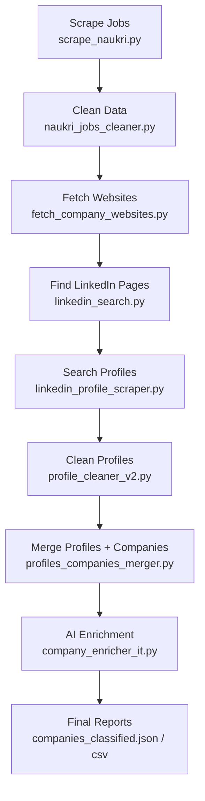

# 🚀 Automated LinkedIn Profile Extraction from Naukri.com  

  
  
  
  

---

## 📌 Overview  
This project automates the extraction of **targeted decision-maker profiles from LinkedIn** based on **Naukri.com job postings**.  

It is designed for **sales prospecting, lead generation, and recruitment intelligence**.  
The pipeline scrapes Naukri job data, enriches it with company websites, finds LinkedIn company pages, extracts relevant people, and uses **AI validation** to ensure only high-quality leads make it to the final dataset.  

---

## 🎯 Business Objective  
✔ Focus on **IT Services** companies (10–200 employees).  
✔ Target **decision-makers** like CEO, Founder, and Marketing Heads.  
✔ Eliminate consultant postings → **only company direct jobs**.  
✔ Deliver a **clean, AI-enriched dataset** for outreach campaigns.  

---

## 🛠️ Tech Stack  
| Component | Tool/Library |
|-----------|--------------|
| **Web Scraping** | Playwright, BeautifulSoup, Requests |
| **Data Handling** | Pandas, JSON, CSV |
| **Search API** | SERPER API (Google Search results) |
| **AI Validation** | OpenAI API |
| **Automation** | Python scripts (modular pipeline) |
| **Storage** | JSON & CSV (Google Sheets-ready) |

---

## 🔄 Workflow Pipeline  



---

## 📂 Script Documentation  

| Script | Purpose | Input | Output |
|--------|---------|-------|--------|
| **`scrape_naukri.py`** | Scrape Lead Gen jobs from Naukri | Naukri.com | `naukri_jobs.csv` |
| **`naukri_jobs_cleaner.py`** | Clean company names & locations | `naukri_jobs.csv` | `naukri_jobs_clean.csv` |
| **`fetch_company_websites.py`** | Find official websites via SERPER API | `naukri_jobs_clean.csv` | `naukri_with_websites.csv` |
| **`linkedin_search.py`** | Crawl websites → LinkedIn company pages & size | `naukri_with_websites.csv` | `company_linkedin_pages.json` |
| **`linkedin_profile_scraper.py`** | Search LinkedIn profiles (Founder, CEO, etc.) | Company list | `linkedin_results.json` |
| **`profile_cleaner_v2.py`** | Deduplicate & validate profiles | `linkedin_results.json` | `linkedin_results_cleaned.json` |
| **`profiles_companies_merger.py`** | Merge profiles + company details | Cleaned profiles + company JSON | `linkedin_profiles_final.csv` |
| **`company_enricher_it.py`** | AI enrichment (relevance, summary, tech) | `linkedin_profiles_enriched.json` | `companies_classified.json` |
| **`merge_company_data.py`** | Backfill missing LinkedIn URLs | Company JSONs | `companies_merged.json` |
| **`update_unknown_companies.py`** | Resolve “Unknown” companies | `linkedin_profiles_cleaned.csv` | `linkedin_profiles_cleaned_updated.csv` |

---

## 🤖 AI Decision-Making  
Two key **AI-powered validation steps** are applied:  
1. **Company Relevance Check** → Ensures company is IT/ITeS, filters out unrelated industries.  
2. **Profile Fit Check** → Confirms if the LinkedIn profile is a decision-maker (CEO, Founder, Marketing Head).  

---

## 📊 Final Deliverables  

✔ `linkedin_profiles_final.csv` → Curated LinkedIn profiles with company data.  
✔ `companies_classified.json` / `companies_classified.csv` → AI-enriched dataset with:  
- Industry summary  
- 10-word company description  
- Technologies used  
- Company size  
- Official LinkedIn URL  

---

## ⚡ Installation & Setup  

1. **Clone the repo**
   ```bash
   git clone https://github.com/your-repo/naukri-linkedin-extractor.git
   cd naukri-linkedin-extractor
   ```

2. **Install dependencies**
   ```bash
   pip install -r requirements.txt
   ```

3. **Set environment variables** in `.env`:
   ```env
   SERPER_KEY=your_serper_api_key
   OPENAI_API_KEY=your_openai_api_key
   ```

4. **Run the pipeline**
   ```bash
   python scrape_naukri.py
   python naukri_jobs_cleaner.py
   python fetch_company_websites.py
   python linkedin_search.py
   python linkedin_profile_scraper.py
   python profile_cleaner_v2.py
   python profiles_companies_merger.py
   python company_enricher_it.py
   python merge_company_data.py
   python update_unknown_companies.py
   ```

5. **Check outputs** in:  
   - `/output/linkedin_profiles_final.csv`  
   - `/output/companies_classified.csv`  

---

## 📌 Notes  
- 🌍 **API Quotas**: SERPER API has daily request limits.  
- 🤖 **AI Costs**: OpenAI API usage incurs token costs per profile check.  
- 🛡️ **Traceability**: Intermediate JSON/CSV outputs are saved for debugging & audits.  

---

## 👤 Author  
**Niraj Vijaysinh Nale**  
🔹 Python Automation | Data Extraction | AI Integration  

📧 Contact: *nirajnale333@gmail.com*  
💼 LinkedIn: *https://www.linkedin.com/in/nirajnale*  
